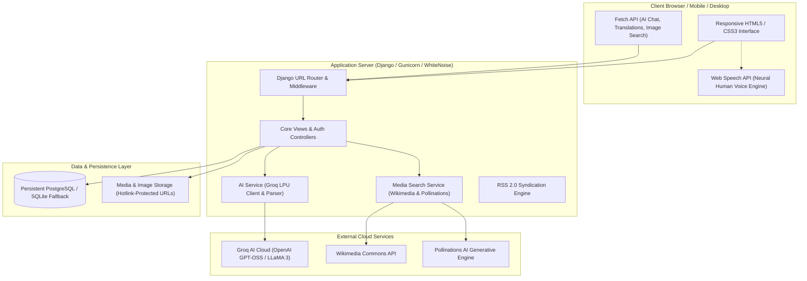

# 🖋️ Posty — AI-Powered Modern Publishing & Editorial Platform

[](https://www.python.org/)
[](https://www.djangoproject.com/)
[](https://www.postgresql.org/)
[](https://groq.com/)
[](https://opensource.org/licenses/MIT)

> **Posty** is a full-stack, luxury-editorial publishing platform designed for modern creators and readers. Built with **Django** and **PostgreSQL**, it pairs high-end typography and responsive UI themes (*Oasis Light* & *Obsidian Dark*) with a state-of-the-art **AI Editorial Suite** powered by **Groq LLMs** (1.2s real-time translation across 12+ languages, assistive writing tools, contextual Q&A chatbot, and neural voice audio narration).

---

## 📖 Table of Contents

- [About This Project](#-about-this-project)
- [System Architecture](#-system-architecture)
- [Source Code Structure](#-source-code-structure)
- [Requirements](#-requirements)
- [Setup Instructions](#-setup-instructions)
  - [1. Local Development](#1-local-development-setup)
  - [2. Production Deployment on Render](#2-production-deployment-on-render)
- [Example Usage](#-example-usage)
- [Screenshots & Demo](#-screenshots--demo)
- [Key Features Summary](#-key-features-summary)
- [License](#-license)

---

## 🌟 About This Project

Traditional blogging platforms are often bloated, disconnected from modern AI tooling, and lack high-fidelity reading experiences. **Posty** was designed from the ground up to unify:

1. **Sub-Second AI Co-Authoring**: Draft articles from scratch, polish tone, expand arguments, fix grammar, or brainstorm viral hooks powered by Groq's high-throughput LPU inference.
2. **Global Real-Time Translation**: Convert full articles (title, subtitle, markdown body) into 12+ international languages (Spanish, French, German, Hindi, Japanese, Telugu, Arabic, etc.) in ~1.2 seconds.
3. **Accessibility-First Natural Audio Narration**: Listen to any post using browser-discovered Neural/Natural human voices with conversational pacing, pause insertion, and an animated audio soundwave visualizer.
4. **Dynamic Media Engine**: Automatically generate custom photorealistic AI concept artwork (via Pollinations AI) or search Wikimedia Commons for unblocked, permanent, high-resolution imagery with fallback protection.
5. **Interactive Engagement**: In-article AI Q&A chatbot ("Ask this article"), smart AI comment reply generator, one-click social bookmarks, likes, author analytics, and RSS 2.0 syndication.
6. **Luxury Dual-Theme Aesthetics**: Handcrafted **Obsidian Dark** (gold and dark turquoise accents) and **Oasis Light** (porcelain parchment gradient `#fbf9f4` to `#f4ede0`, deep obsidian typography, and soft card elevation).

---

## 🏛️ System Architecture

Posty follows a decoupled, resilient MVC (Model-View-Template) pattern orchestrated by Django, communicating with external cloud LLMs, persistent databases, and web speech APIs:



### Architectural Highlights:
* **Hybrid Database Support**: Dynamically binds to managed PostgreSQL via `dj-database-url` in production while seamlessly using SQLite for offline local development.
* **Resilient Media Serving**: Direct CDN URL prioritization with fallback validation (`storage.exists`) and browser `onerror` recovery ensures images never break or render blank boxes.
* **Sub-Second LLM Parsing**: Uses active high-throughput models (`openai/gpt-oss-20b`, `qwen/qwen3.8-27b`, `groq/compound-mini`) with multi-layer JSON stripping to eliminate gateway timeouts.

---

## 📂 Source Code Structure

```text
Posty/
├── myproject/                   # Django Core Project Configuration
│   ├── __init__.py
│   ├── settings.py              # Environment bindings, Whitenoise, PostgreSQL config
│   ├── urls.py                  # Master URL routing & production media handlers
│   ├── wsgi.py                  # Production WSGI application gateway
│   └── asgi.py                  # ASGI entry point
│
├── my_app/                      # Core Application Package
│   ├── models.py                # Post, Comment, Profile models with resilient properties
│   ├── views.py                 # Views for feed, reader, drafts, author profiles & AI endpoints
│   ├── forms.py                 # PostForm, ProfileForm, CommentForm, UserRegistrationForm
│   ├── ai_service.py            # Groq LLM integration (writing, translation, Q&A, chat)
│   ├── image_search.py          # Wikimedia Commons, Web search & Pollinations AI generation
│   ├── feeds.py                 # RSS 2.0 syndication feed generator
│   ├── tests.py                 # Comprehensive unit & integration test suite (23 tests)
│   │
│   ├── static/
│   │   ├── style.css            # Responsive layout, Obsidian & Oasis Light theme tokens
│   │   └── images/
│   │       └── logo.png         # Posty brand insignia
│   │
│   └── templates/               # Semantic Django HTML Templates
│       ├── base.html            # Top navbar, mobile theme grid, footer & toast scripts
│       ├── home.html            # Luxury editorial landing page (Hero, Spotlight, AI suite)
│       ├── display-post.html    # Feed listing, category filter, and weighted search
│       ├── read-post.html       # Article reader, Neural TTS player, AI Q&A, comment section
│       ├── add-post.html        # Post creator with live AI tools & image search modal
│       ├── update-post.html     # Post editor with real-time preview & image URL input
│       ├── profile.html         # Author portfolio, bio, statistics, and article grid
│       ├── edit-profile.html    # Photo upload, AI Avatar generator, and live preview
│       ├── drafts.html          # Author private workspace
│       ├── analytics.html       # Author engagement metrics (views, likes, bookmarks)
│       ├── bookmarks.html       # User reading list
│       ├── login.html           # Authentication portal
│       └── register.html        # User onboarding
│
├── .env.example                 # Template for environment configuration
├── build.sh                     # Render production build script (pip install, collectstatic)
├── Procfile                     # Gunicorn web process definition
├── render.yaml                  # Infrastructure-as-Code Blueprint for Render & PostgreSQL
├── requirements.txt             # Production dependencies
└── README.md                    # Project documentation
```

---

## 📦 Requirements

### Runtime Environment:
* **Python**: `3.10` or `3.11+`
* **Operating System**: Windows, macOS, or Linux

### Python Dependencies:
| Package | Version | Purpose |
| :--- | :--- | :--- |
| `Django` | `>=5.0` | Web framework & ORM |
| `gunicorn` | `>=21.2.0` | Production WSGI HTTP server |
| `whitenoise` | `>=6.5.0` | Compressed static file serving |
| `Pillow` | `>=10.0.0` | Image processing & avatar uploads |
| `psycopg2-binary` | `>=2.9.9` | PostgreSQL database adapter |
| `dj-database-url` | `>=2.1.0` | Environment-based database configuration |
| `groq` | `>=0.9.0` | High-speed LLM inference |
| `requests` | `>=2.31.0` | HTTP client for APIs & image verification |
| `python-dotenv` | `>=1.0.0` | Environment configuration loading |

---

## 🚀 Setup Instructions

### 1. Local Development Setup

#### Step 1: Clone the Repository
```bash
git clone https://github.com/BhaskaraRao-Aerupilli/Posty.git
cd Posty
```

#### Step 2: Create and Activate a Virtual Environment
* **Windows (PowerShell)**:
  ```powershell
  python -m venv venv
  .\venv\Scripts\Activate.ps1
  ```
* **macOS / Linux**:
  ```bash
  python3 -m venv venv
  source venv/bin/activate
  ```

#### Step 3: Install Dependencies
```bash
pip install -r requirements.txt
```

#### Step 4: Configure Environment Variables
Create a `.env` file in the root directory:
```ini
DJANGO_SECRET_KEY=your-random-django-secret-key
DJANGO_DEBUG=True
DJANGO_ALLOWED_HOSTS=127.0.0.1,localhost
GROQ_API_KEY=your_groq_api_key_here
```
*(Get a free Groq API key from [console.groq.com](https://console.groq.com/keys)).*

#### Step 5: Run Database Migrations
```bash
python manage.py migrate
```

#### Step 6: Start the Development Server
```bash
python manage.py runserver
```
Visit **`http://127.0.0.1:8000/`** in your browser.

---

### 2. Production Deployment on Render

Posty includes out-of-the-box support for **Render** via `render.yaml` and `build.sh`:

1. **Push your code to GitHub**:
   ```bash
   git push origin main
   ```
2. **Create a Free PostgreSQL Database on Render**:
   * On [dashboard.render.com](https://dashboard.render.com/), click **New +** ➔ **PostgreSQL**.
   * Name: `posty-db`, select the **Free** tier, and click **Create Database**.
   * Copy the **Internal Database URL** (`postgres://...`).
3. **Deploy the Web Service**:
   * Click **New +** ➔ **Web Service** ➔ Connect your `Posty` repository.
   * **Build Command**: `bash build.sh`
   * **Start Command**: `gunicorn myproject.wsgi:application`
   * Under **Environment Variables**, add:
     * `DJANGO_DEBUG` = `False`
     * `DJANGO_ALLOWED_HOSTS` = `*`
     * `DATABASE_URL` = *(Paste the Internal Database URL from Step 2)*
     * `GROQ_API_KEY` = *(Your Groq API key)*
4. Click **Deploy Web Service**. Render will automatically run migrations, collect static assets, and deploy Posty live with persistent data!

---

## 💡 Example Usage

### 1. Generating or Polishing Articles with AI
* Go to **New Post** (`/add-post/`).
* Click **Generate with AI** ➔ Enter a topic (e.g., *"The Future of Quantum Computing"*), select a tone (*Engaging, Academic, Storytelling*), and Posty AI will craft a complete, formatted article.
* Use the inline **AI Toolbar** (*Polish*, *Expand*, *Shorten*, *Fix Grammar*) to refine specific paragraphs.

### 2. Generating AI Concept Artwork or Attaching Web Images
* In the Post Creator, click **Generate AI Artwork** ➔ Posty prompts the generative model to create 1200x630 cinematic concept art.
* Click **Web Images** to search Wikimedia Commons and live web imagery with one-click form attachment.

### 3. Listening via Natural Audio Narration
* Open any article ➔ Click **Listen** in the player.
* Select your preferred human voice from the **Voice Selector** (*Google US Natural*, *Microsoft Jenny*, *Apple Samantha*).
* Adjust narration speed (0.9x warm to 1.3x brisk) while the pulsing turquoise soundwave reflects live playback.

### 4. Real-Time Multilingual Translation
* In the reader toolbar, select any of the 12+ supported languages (*Spanish, French, Hindi, German, Japanese, Telugu, Arabic, etc.*).
* The article's title, subtitle, and body text translate in ~1.2s without reloading the page. Click **Reset Original** to switch back anytime.

### 5. Interactive Post Q&A Chatbot
* In the reader view, click **AI Assistant** ➔ ask any question about the article (e.g., *"Summarize the 3 main arguments"* or *"What are the practical applications mentioned?"*). Posty AI answers in seconds using full article context.

---

## 📸 Screenshots & Demo

| Feature | Preview Description |
| :--- | :--- |
| **Luxury Editorial Home** | Featured Story Spotlight, AI Feature Showcase, 3-Column Recent Posts, and Category Quick Filter. |
| **Assistive AI Authoring** | In-form AI generation modal, writing toolbar (Polish/Expand/Fix), and live image preview. |
| **Reader View & Neural TTS** | Clean typography, integrated audio narration player with soundwave visualizer, and social engagement bar. |
| **Real-Time Translation** | 1.2s multi-language translation toolbar with instant DOM swapping. |
| **Dual Theme System** | Responsive navbar with 2x2 mobile theme picker supporting **Obsidian Dark** and **Oasis Light**. |

---

## ⚡ Key Features Summary

* ✅ **Assistive AI Writer**: Draft generation, tone polishing, length expansion/contraction, and grammar correction.
* ✅ **1.2s Real-Time Translation**: 12+ international languages with structured formatting retention.
* ✅ **Natural Neural TTS**: Speech synthesis with browser-detected human voices and conversational punctuation parsing.
* ✅ **Dynamic Media Pipeline**: Wikimedia Commons API + Pollinations AI artwork with automatic cross-origin fallback recovery.
* ✅ **Weighted Relevance Search**: Multi-term tokenized search prioritizing title, category, and author matches.
* ✅ **Cloud Persistence**: Persistent PostgreSQL database integration on Render with zero data loss across redeployments.
* ✅ **Responsive Design**: Fluid `clamp()` typography and 2x2 mobile drawer navigation optimized from 320px phones to 4K displays.
* ✅ **Automated Test Suite**: 23 automated tests verifying AI services, authentication, translations, feeds, and responsiveness.

---

## 📄 License

This project is licensed under the **MIT License**. See the [LICENSE](LICENSE) file for details.
